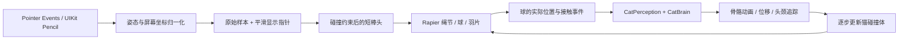

# Heihei 互动猫产品需求与交互规格

版本：2026-09-18 · 当前 V2 实现基线与下一轮验收规格  
平台：桌面浏览器、iPad Safari、可选的 iPad 原生 WKWebView 宿主  
资产：四足暹罗猫 v10、逗猫棒 v3  
状态词：**已实现**指仓库代码具备该行为；**自动验证**指有测试或构建证据；**设备验证**指用户在 iPad 上观察过；**待验收**指本轮尚无足够真机或录像证据。

## 1. 产品问题与目标

Heihei 是一个以四足暹罗猫为中心的空间互动演示。用户应能像拿真实逗猫棒一样，用 Pencil 的笔尖、倾角和晃动带动绳球；猫观察球、靠近、追逐、左右拨爪或扑跳。玩具碰到猫与地面时应被挡住并产生反应，不出现明显穿模或突然飞出画面的情况。

本版特别解决三种已观察到的问题：反复只伸右前爪、已开始动作后头不再跟随移动的球、笔上下抖动时绳球大幅弹出画面。实现以自然可理解的玩法优先；主界面只保留猫和设置入口，诊断与手动控制按需展开。

主要使用者是拿 Pencil 在 iPad 上玩球的人。次要使用者是用鼠标预览的设计与开发人员，以及需检查输入与动作数据的交互研究者。成功体验是：第一次移动笔就能找到球，改变笔的方向能带动系绳点，猫始终关注可见目标，拨爪与碰撞看起来和球的位置相符。

## 2. 版本范围与证据边界

| 能力 | 当前状态 | 证据与边界 |
| --- | --- | --- |
| 四足猫、32 根骨骼、12 个动作、头颈追踪 | 已实现、自动验证 | [模型配置](web/public/assets/cat_asset_config_v10.json) 与实际 GLB 测试；眼球没有独立转动 |
| Pencil 悬停与接触姿态 | 原生宿主已设备验证 | UIKit 倾角、方位会变化；Safari 悬停曾只给默认角度，不能视作实测 |
| 笔尖对齐短棒头及悬停／接触连续切换 | 已设备验证 | 用户在上一版原生宿主上确认；本次物理调校尚未重新上机 |
| 12 节绳、动态球、五片三节羽毛、猫和地面碰撞 | 已实现、部分自动验证 | 球与猫、羽毛与地面的数值测试通过；所有可见羽片在所有视角绝不穿模仍待录屏验收 |
| 左右拨爪、动作中持续看球、收窄上下抖动 | 已实现、自动验证、桌面目视检查 | 23 项网页测试通过；本次改动的 Pencil 真机手感待验收 |
| 目标 iPad 60 FPS、5 分钟稳定运行 | 上一版设备验证 | 原生宿主录屏曾显示约 60 FPS、累计 P95 17 ms；本版需重测 |

本 PRD 记录当前行为与应达到的验收标准，不把自动测试等同于真实笔的手感测试。原始 V0/V1 构想中的永久 AI 性格、双指悬停及眼睛独立追踪尚未实现。

## 3. 核心用户流程

1. **进入**：页面加载猫、逗猫棒 v3 和物理模块。没有活动笔或指针时，玩具不显示，猫待机。加载失败显示原因与“重试”，暂停逗猫棒。
2. **逗猫棒**：默认模式下，Pencil 悬停或鼠标移入场景；短棒头起点贴近笔尖，倾斜改变棒头末端的系绳点。绳带着编织球和羽毛滞后摆动。
3. **猫的回应**：猫先看球，再按球的距离、高度、速度选择观察、走近、追逐、拨爪或扑跳。动作已经开始时允许球移走造成扑空，但头颈继续追踪当前可见球。
4. **接触**：棒头不能直接穿过猫；球弹开，羽毛和绳受猫与地面约束。头部轻触产生短时缩头，前爪碰球可拨动球；连续接触有冷却。
5. **其他模式**：设置里可切到“双指零食”或“观察”。双指捏住零食移动、松开后落下；观察模式可转动视角。手动动作、参数、诊断与 CSV 都隐藏在设置内。

## 4. Pencil 与屏幕映射规格

### 4.1 输入源与有效性

| 输入 | 位置 | 姿态 | 距离 | 说明 |
| --- | --- | --- | --- | --- |
| iPad Safari Pointer Events | `clientX/clientY` | `altitudeAngle/azimuthAngle` 或 `tiltX/tiltY`，只有实际可信时标记实测 | 标准网页事件通常没有离屏距离 | 可使用设置中的模拟高度 |
| iPad 原生宿主 | UIKit 的位置经网页视口归一化 | `UIHoverGestureRecognizer` 或接触的 `UITouch` 倾角／方位 | `zOffset`，设备归一化值 | 通过 `heihei-pencil` 事件送入同一网页；原生通道活动时停用重复网页笔事件 |
| 鼠标 | 指针位置 | 默认垂直方向 | 设置中的模拟值 | 开发预览；不得标记为 Pencil 实测 |

浏览器可能返回固定 `90°/0°`。诊断必须同时报告字段存在性、当前事件是否为可信实测、悬停与接触分别累计的变化；“历史曾变化”不能替代“当前事件有有效角度”。可信角度缺失时，网页至多沿用上一次实测方向 100 ms，并标记为 `held`，不能声称本次实测。原生输入包包含位置、姿态、时间戳、`hover/contact` 通道与 `began/changed/ended/cancelled` 阶段；接触优先于同一时刻结束的悬停。`zOffset` 只标为归一化值，**不转换成厘米**。

### 4.2 方向与位置

- 屏幕坐标经相机射线投向相机朝向的交互平面。该平面按模拟高度或归一化距离沿相机视线移动，因而棒头起点在屏幕上的投影仍贴着笔尖。当前实现的“高度”实际改变**相机深度**，不等同于世界坐标 Y 或真实离屏厘米。
- 默认归一化映射为 `depth = clamp((zOffset-min)/(max-min), 0, 1) × 0.22 m`，默认 `min=0`、`max=1`；无距离字段时使用 `0.18 m` 模拟值。设置可调这几个值。
- `tiltX/tiltY` 转为球面角：`altitude = atan2(1, hypot(tan(tiltX), tan(tiltY)))`，`azimuth = atan2(tan(tiltY), tan(tiltX))`（角度先转弧度）。已提供可靠球面角时优先使用球面角。
- 用相机右、上、朝外三个基向量得到棒头方向：`d = normalize(-right·cos(a)cos(h) + up·sin(a)cos(h) - outward·sin(h))`，其中 `a=azimuth`、`h=altitude`。用方向向量而非角度数值做平滑，方位跨 0°/360° 时不绕一圈。
- 默认虚拟短棒头长 `0.04 m`，目标系绳点为 `笔尖世界位置 + d × 0.04 m`。可见棒头最终从**碰撞修正后的系绳点**反推起点，防止视觉棒头与物理绳脱节。棒头长度只在设置中调整。
- 原始位置、速度和合并事件样本独立保存；画面指针 X/Z 平滑率 15、Y 平滑率 11、方向平滑率 13。物理步骤按原始样本顺序取目标，避免把真实快速晃动完全滤掉。

### 4.3 事件边界

笔离开场景、模式切换或原生悬停与接触都结束时，玩具隐藏并清空物理链；重新进入时棒头、球与羽片中心先做地面和猫碰撞区推出，羽片胶囊的完整可见边缘仍需真机检查。恢复标签页时清空积压的物理时间，避免一次性爆甩。双指触控不与原生笔通道争夺控制权。旋转视角后方向按当前相机重新计算。

## 5. 猫的交互行为规格

猫感知的是**物理求解后的球位置与速度**，不是笔尖。每帧用球和猫根节点的水平距离、高度与速度构造感知状态；当前渲染循环使用上一帧球状态，约有一帧感知延迟。`WATCH` 不要求猫一直行动：慢且近的球可以只被注视。

| 事件或条件 | 当前行为 | 可调／边界 |
| --- | --- | --- |
| 首次看到球 | `IDLE → NOTICE → WATCH`，先转头再决定移动 | 默认反应延迟 0.25 s，设置范围 0.1–0.4 s |
| 球在远处 | 转身并走到距目标约 0.25 m 处 | 水平距离大于 0.37 m；移动目标约每 0.12 s 刷新 |
| 球贴地移动 | `CHASE`，带少量速度预测追逐 | 速度大于 0.16 m/s、高度低于 0.29 m、距离大于 0.23 m；跑速默认 0.25 m/s |
| 球在爪边 | 播放 `pawLeft` 或 `pawRight` 一次 | 距离小于 0.34 m、高度低于 0.37 m、速度低于 0.65 m/s；须同时通过动作冷却 |
| 球较高 | `CROUCH → JUMP → LAND → RECOVER` | 距离小于 0.86 m、高度高于 0.32 m 且低于 0.82 m、能量大于 0.25；在与拨爪重叠的高度区间，跳跃优先 |
| 球被抽走 | 已开始的爪或跳跃动作做完；扑跳落地时判断是否扑空 | 当前球相对起跳时锁定位置偏离超过 0.26 m，或球不可见，记为扑空 |
| 球连续停在原位 | 不机械重复同一动作 | 上次动作后需超过 1.6 s，且球移动超过 0.09 m；恢复默认 0.68 s |
| 球在左／右 | 使用靠球的前爪 | 按猫当前朝向变换到局部 X；`X>0.075 m` 用左爪，`X<-0.075 m` 用右爪；中线区轮换上一只爪 |

头颈在 `NOTICE/WATCH/APPROACH/CHASE/PAW/CROUCH/JUMP/LAND/RECOVER` 中都追踪**当前可见目标**；起跳时锁定的位置只用于判断扑空，不冻结视线。目标不可见则平滑回正。头与颈的默认权重分别为 60% 与 40%，水平限幅分别为 ±55° 与 ±25°，上看 35°、下看 25°，响应率 7；目标超出约 70° 时根节点可慢速转身。骨骼叠加每帧从当前动画姿态重算，避免逐帧累加扭曲。眼球是贴图，当前没有独立眼睛视线控制。

猫与玩具接触会生成部位、位置、方向、强度和玩具类型事件。同一部位默认 0.7 s 冷却；头／口鼻轻触产生约 0.42 s 的缩头叠加，身体接触提示关注，前爪与低速球接触时再给球一个小冲量。`CROUCH/JUMP/LAND` 中不触发接触反应，以免打断完整落地。猫的根身体保持骨骼动画控制，不做布娃娃弹飞。

### 零食和手动模式

设置中的双指零食模式使用两指中心投向地面；两指距离缩小超过 2 px 标为 `PINCH`，扩大超过 2 px 为 `SPREAD`。在零食附近约 0.42 m 内捏住后可拖到默认 0.34 m 高，松手按 `3.6 m/s²` 下落到 `0.02 m`。猫靠近到约 0.24 m 后播放闻嗅动作。它是未来双指悬停的触屏代理，**不宣称 iPad 已支持双指悬停**。

手动观察、转头、移动与 12 个动作仅在设置中使用。Walk/Run 是原地骨骼循环，世界位移由移动控制器计算；默认走速 0.10 m/s、跑速 0.25 m/s、转身 2.2 rad/s，动作播放速度按实际位移与配置中的基准速度调整。

## 6. Rapier 物理动态规格

### 6.1 更新时序与物体

使用锁定版本 `@dimforge/rapier3d-compat@0.20.0`，世界重力为 `(0,-9.81,0) m/s²`。物理固定步长 `1/120 s`，一帧最多执行 8 步、时间积压上限 0.05 s；显示绳线沿前后物理状态插值。动画先更新骨骼，猫碰撞体再跟随骨骼；接着给棒头设定下一步运动目标、恢复羽片形状、推进世界、收集接触，最后渲染。物理模块初始化失败时显示重试，不退回会穿模的装饰绳。

| 组成 | 当前刚体、关节与碰撞 |
| --- | --- |
| 棒头末端 | 半径 0.007 m 的运动学球；目标路径对猫做形状扫掠与推出，地面留最小间隙。碰撞优先于强制跟随笔 |
| 绳 | 总长默认 0.24 m，12 个动态球链节，每节约 0.02 m，以绳关节连接；链节半径 0.003 m、附加质量 0.002、线性阻尼 1.2、角阻尼 2 |
| 编织球 | 半径 0.036 m、附加质量 0.025、线性阻尼 0.6、角阻尼 1.6、恢复系数 0.45、摩擦 0.55；动态刚体，可摆动、滚动、弹开 |
| 羽毛 | 五片、每片三个动态胶囊段，由球与球形关节串联；片长分别约 0.177/0.146/0.164/0.127/0.142 m，碰撞半径约 0.047/0.037/0.041/0.028/0.034 m，每段附加质量 0.003、线性阻尼 3.2、角阻尼 5 |
| 地面 | 顶面为世界 Y=0 的静态碰撞体；球、绳与羽毛与其接触 |
| 猫 | 按 32 根骨骼映射追踪头、耳、颈、胸腹、臀、四肢与尾巴；当前配置实际生成 27 个运动学球形碰撞区。碰撞球是近似轮廓，不等于可见网格表面 |

绳节、球和羽片开启 CCD，以减少快速扫过时的漏碰。玩具与猫、地面可碰撞；当前玩具内部各段整体不自碰撞，以减少链节抖动。可见线条直接连接物理链位置，不另播装饰曲线。球与羽毛的视觉网格以刚体／骨骼段姿态驱动。

### 6.2 从“抖笔”到“球摆动”

1. 笔尖位置和方向产生目标系绳点 `T = P + d·L棒头`。即使 `P` 不变，倾斜与转向也能改变 `T`。
2. `T` 先经过猫碰撞区的推出及从上一点到目标点的形状扫掠，得到实际棒头位置。用户把笔移进猫体内时，棒头停在表面附近。
3. 运动学棒头牵动第一段绳；绳关节只限制最大分离距离，允许松弛。每节的质量、惯性、重力与阻尼使急甩出现滞后，停笔后摆幅逐渐衰减。
4. 末端球的质量、摩擦与弹性决定撞猫／着地后的反弹和滚动。接触不能通过“把球瞬间设到笔下方”来伪造。
5. 每个羽片有三段碰撞体。每步给各段一个朝当前形状目标的微小恢复冲量 `Δp = 0.00025 × (目标位置 − 当前段位置)`；关节和阻尼使它受撞击弯折、停止后复形。
6. 球很低时羽片应侧向贴地。当前低位目标方向先向同一侧扇开：`fall = clamp((ballY−0.10)/0.18,0,1)`；`fall` 从 0 增至 1 时，方向由略上扬的侧向逐渐转为向下。这样五组羽片不会在地面上被竖直关节同时顶起。侧向展开角按羽片序号以约 0.16 rad 递增。

默认归一化距离的最大虚拟深度由旧的 0.55 m 收到 0.22 m，使笔上下抖动输入不再被大幅放大。此值只控制输入到场景的范围；绳球仍由物理求解，不叠加预制抖动动画。设置可调绳长、棒头长和高度比例，改变绳长时重建物理链。

### 6.3 碰撞、误差和表现边界

物理接触用于阻挡球、链节和胶囊羽毛；猫骨骼每步同步碰撞球。记录接触时按“身体部位 × 玩具类型”去重，包含接触点与速度强度。球碰前爪且球速小于 2 m/s 时施加约 `0.004` 的拨球冲量。

验收目标：静止或正常摆动时绳长误差控制在标称长度的 5% 左右；球与猫碰撞体的数值重叠不超过 2 mm；羽毛和绳需在正面、侧面、背面及猫运动中做**可见网格**逐帧审查。现有自动测试证明部分球碰撞场景与低位羽片不穿地，不能据此宣称所有羽片、细绒和猫可见表面都达到 2 mm。需要先查看碰撞轮廓再定点补齐差异。

## 7. 设置、反馈与本地数据

主界面只显示 Heihei、场景和一个设置入口。设置按“互动方式、模拟高度、猫当前状态、手动动作、互动调试与记录、模型参数、观察角度”渐进展开。用户应从状态文案看到猫当前在等待、关注、追逐还是恢复；诊断需显示输入来源、悬停／接触角度、当前可信性、球位置、物理步数、接触部位、FPS 与帧耗时。调试选项不应抢占默认玩法。

| 设置控制 | 默认与范围 | 对互动的影响 |
| --- | --- | --- |
| 模式 | 默认逗猫棒；另有双指零食、观察 | 切换模式清除旧玩具或零食的活动状态，避免两个交互同时驱动猫 |
| 模拟高度 | 默认 0.18 m，范围 0–0.60 m | 只用于网页无距离字段的输入；本质上改变相机深度 |
| 归一化距离标定 | 最小 0、最大 1；分别可调 0–0.9、0.1–2 | 决定 `zOffset` 如何压到 0–1；当前界面没有阻止最大值小于最小值，属于待修正边界 |
| 虚拟高度比例 | 默认 0.22 m，范围 0.1–1 m | 改变上下悬停对场景深度的最大影响；过大可能重新出现强烈甩动 |
| 短棒头长度 | 默认 0.04 m，范围 0.02–0.10 m | 笔尖不动时，倾角带动系绳点的幅度 |
| 绳长 | 默认 0.24 m，范围 0.16–0.40 m | 变更后重建物理链；摆动半径随之改变 |
| 观察与调试 | 3/4、正、侧、背面，复位；骨骼、目标、猫碰撞轮廓开关 | 不直接改已有刚体；视角改变会影响后续笔方向的相机坐标换算 |

切换到手动动作会进入观察模式，避免自主决策立即覆盖所选动画；“复位”恢复猫的位置、动作、视角与默认逗猫棒模式。打开设置对话框时，画面可见区域里的笔事件仍应进入诊断，指针位于设置面板内部时不驱动玩具。

CSV 仅在用户按“开始记录”后，以约 20 Hz 在当前网页内存采样；停止后用户可手动导出。记录原始／平滑位置、输入来源与姿态、球与猫位置、动作状态、目标距离和接触字段；没有后台上传。当前 `contactPart/contactStrength` 是**最近一次接触**，不是严格的一行对应一个新事件。当前 CSV 的 `rawY/filteredY/velocityY` 存放世界 Z，`rawHeight/filteredHeight/velocityZ` 存放世界 Y；研究分析必须先按这一映射解释，后续需做列名迁移，不能直接按字面坐标轴使用。

## 8. 可测成功标准与验收

| 场景 | 验收方法 | 目标 | 当前结论 |
| --- | --- | --- | --- |
| 左右拨爪 | 把球分别放在猫局部左、右与中线，连续触发 | 左右各可触发；中线连续动作交替，不固定右爪 | 自动测试通过；真机视觉待复核 |
| 持续看球 | 在 `PAW/CROUCH/JUMP/LAND/RECOVER` 中移球 | 头颈持续指向当前可见球；不可见后回正；动作完整结束 | 目标更新测试通过；真机视觉待复核 |
| 垂直抖笔 | 固定笔尖 XY，做慢速和快速上下抖动；录屏记录棒头与球最高点 | 轻抖细微传递、急甩有滞后、停止衰减，不出现异常飞出画面 | 桌面固定步长测试通过；本版 Pencil 真机待验收 |
| 绳与碰撞 | 球、绳、羽毛从正／侧／背扫过，猫主动走路、拨爪、跳跃 | 球真实弹开；绳和羽片被阻挡；地面与猫无明显可见穿透 | 球碰撞与羽片贴地数值测试通过；完整录屏待验收 |
| 姿态连续性 | 悬停→接触→抬起、左右／前后倾斜、转向跨 360°、横竖屏 | 短棒头起点贴笔尖；姿态方向不翻转；输入来源如实显示 | 上一版悬停与接触、笔尖对齐已设备验证；横竖屏与本版待验收 |
| 稳定运行 | 目标 iPad 连续互动 5 分钟，查看帧统计与录屏 | 60 FPS 为目标；95% 帧耗时 ≤25 ms；恢复页面不爆甩 | 上一版应用内统计 P95 17 ms；本版待重测 |

自动回归入口：在 `web/` 运行 `npm test`、`npm run build`。当前 23 项测试覆盖实际 GLB、动作切换、姿态换算、笔尖位置、左右爪、动作中追踪、低位抖动、12 节链、球与猫碰撞、前爪接触及冷却。页面上线后须重新抓取实际 HTML 和资源，检查它们属于新构建；仅有本地构建通过或线上 HTTP 200 不算部署验收。

## 9. 风险、限制与后续决策

- **真实距离语义**：Safari 网页并无标准的厘米级悬停距离。当前归一化 `zOffset` 映射是手感参数，不代表真实笔尖离屏高度。若要研究厘米距离，应另做设备标定与独立实验。
- **相机深度与世界高度**：当前高度参数沿相机视线移动交互平面。命名在界面上容易被理解为世界 Y；后续版本应根据用户测试决定是否改文案或改映射，不在本次发布中偷偷改变坐标意义。
- **可见羽毛边缘**：碰撞胶囊与羽片网格和细绒不完全重合。2 mm 只能对明确的碰撞体数值测试成立；完整防穿模需要多视角真机逐帧复核。
- **表演资产**：前爪是预制动作，没有 IK 指尖校准；眼睛是贴图，没有眨眼、独立视线和口型；身体材质无毛发模拟。
- **数据语义**：CSV 轴名和最近接触字段需要版本化整理后才能作为研究数据使用。
- **平台性能**：目标 iPad 的新版抖动手感、5 分钟性能与横竖屏姿态仍待实机复测。失败时保留上次通过的视频与 QA 报告，不把桌面结果称作设备结果。

本轮不做长期 AI 性格、LLM 决策、路径规划、布娃娃猫、双指悬停、真实厘米级空中高度或完整毛发模拟。若后续引入这些能力，应先明确用户价值及与当前自然玩球体验的关系，再单独更新本 PRD。

实现与复核入口：[README](README.md)、[V2 验收记录](qa/web/acceptance_v2.md)、[本次玩球复核](qa/web/acceptance_play_2026_09_17.md)、[物理控制器](web/src/v2/physics.js)、[猫的行为规则](web/src/v1/cat_brain.js)。
