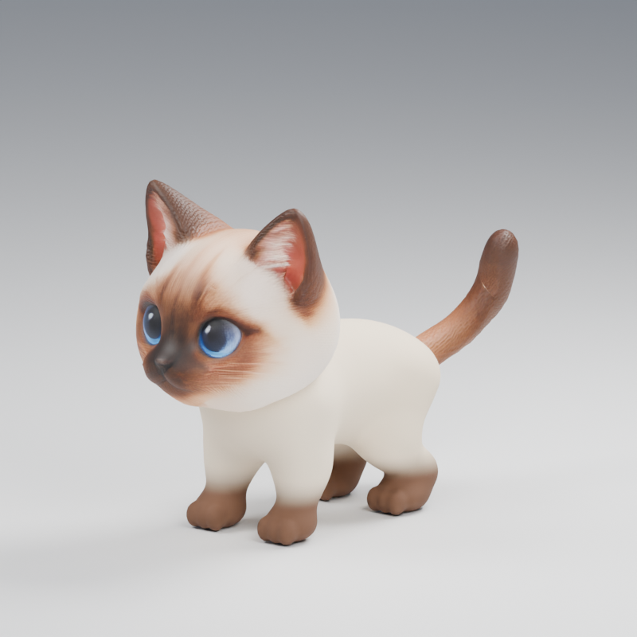

# Interactive Pet · Miso

一只可以在浏览器里逗弄的四足暹罗猫。模型按用户的 Q 版设定制作：圆润的身体、短厚的腿、蓝眼睛和重点色耳爪。V1 将 Apple Pencil 或鼠标输入映射为 3D 逗猫棒，羽毛有惯性与摆动，猫感知羽毛后自行决定观察、靠近、追逐、伸爪或扑跳。V0 的 12 个骨骼动作与手动控制仍可从折叠面板使用。



[在线体验](https://purryc.github.io/interactive-pet/) · [完整动作预览](output/siamese_cat_quadruped_v10.mp4)

## 本地运行

需要 Node.js 20.19 或更新版本。在 `web/` 内运行：

```sh
npm ci
npm run dev
```

打开 `http://localhost:5179/`。macOS 也可以双击根目录的 `launch_miso.command`。iPad 与 Mac 在同一网络时，可在 iPad Safari 打开 Mac 的局域网地址及 `5179` 端口。执行 `npm test` 检查实际 GLB 和 V1 决策链，执行 `npm run build` 生成静态网页。

## 怎么玩

- **逗猫棒（默认）**：Apple Pencil 悬停或移动鼠标，驱动棒身、末端、绳和羽毛。猫先关注羽毛，再按距离、高度与速度决定行动。滑块用于模拟网页拿不到的离屏高度；把高度调高，可测试准备、扑跳与扑空。
- **双指零食**：在零食附近用两指捏合并移动，松开后零食下落；猫靠近并低头闻。它是未来双指悬停的触屏代理。
- **观察**：拖动旋转、滚动缩放，或切换正面、侧面、背面。
- **手动动作与 V0 控制**：展开后可使猫直接转头、点击移动、播放 12 个动作。手动动作不会被 V1 自主决策立即打断。
- **动作**：待机、走路、小跑、下蹲、左右伸爪、跳跃、落地、坐下、张望、嗅闻、伸懒腰。跳跃按钮按下蹲→起跳→落地→待机播放。
- **演示**：播放或保存约 15 秒本地画布录像；不会录制麦克风或屏幕。
- **调试与记录**：展开「互动调试与记录」可调平滑、羽毛物理和猫的响应时间，查看原始／平滑输入与猫的决策，按「开始记录」「停止」「导出 CSV」保存当前会话。日志只保留在网页内存，除非你主动导出。

## 模型文件

| 文件 | 用途 |
| --- | --- |
| [`output/siamese_cat_quadruped_v10.blend`](output/siamese_cat_quadruped_v10.blend) | Blender 5.2 可编辑模型，32 根骨骼、12 个 Action、展示时间线 |
| [`output/siamese_cat_quadruped_v10.glb`](output/siamese_cat_quadruped_v10.glb) | 网页运行用骨骼动画模型 |
| [`output/cat_asset_config_v10.json`](output/cat_asset_config_v10.json) | 骨骼映射、动作名、坐标和交互参数 |
| [`output/siamese_cat_quadruped_v10.mp4`](output/siamese_cat_quadruped_v10.mp4) | 24.67 秒动作预览 |

Blender 中选中 `Cat_Rig` 并进入 Pose Mode 可以编辑骨骼。要单独修改 Action，先静音 `Quadruped showcase` NLA 轨道。Walk／Run 是原地动画，位移由网页控制。GLB 采用 Y 向上、+Z 朝前，换算尺寸以配置文件为准。

## 源码与验证

`web/src/` 将模型、动作、头颈追踪、移动和输入适配分开；`web/src/v1/` 实现空间输入、逗猫棒与羽毛、猫的感知／决策、双指零食和本地记录。`src/` 保存 v10 的建模、绑定、动作、导出及回导脚本；`reference/` 保存选定设定图和[来源说明](reference/README.md)。v10 的 Blender 重建需要 `output/siamese_cat_quadruped_v6.blend`，它已包含在仓库中。可在安装 Blender 5.2 和 Python 后运行：

```sh
python3 -m venv qa/.venv_sculpt
qa/.venv_sculpt/bin/pip install -r src/requirements_sculpt.txt
qa/.venv_sculpt/bin/python src/produce_v10.py
```

若 Blender 命令未在 PATH 中，可通过 `BLENDER_BIN` 指定其可执行文件。构建会重写 v10 输出；需要保留改动时先另存副本。所有 12 个动作通过逐帧网格及边界检查，1902 个支撑爪样本通过接地检查，GLB 回导和网页的 5 项控制器测试通过；详见 [`qa/anatomy_review_v10.md`](qa/anatomy_review_v10.md) 与 [`qa/web/acceptance_v10.md`](qa/web/acceptance_v10.md)。

## 当前边界

体表是平滑材质和渐变重点色，没有设定图中的蓬松毛发模拟。眼球、眨眼和嘴部动画尚未制作，前爪动作沿用预制动画，没有 IK 修正。Safari Pointer Events 提供 Apple Pencil 的屏幕位置与倾角，标准网页事件不提供真实离屏距离；V1 将这项输入明确标为「模拟高度」，可在调试面板设标定参数。真正的离屏距离输入需要原生 iPad 接口或未来浏览器支持。网页已完成桌面加载和 iPad 尺寸排版检查；真机笔悬停与双指操作需在解锁的设备上验收。本仓库没有附角色图像、模型或代码的复用许可证。
